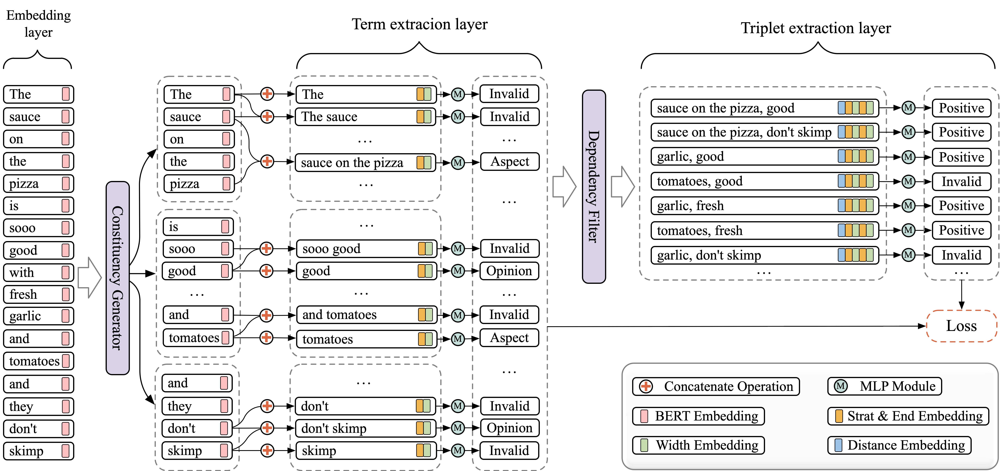

## SyntaxSpan
Codes for paper SyntaxSpan: exploiting syntax information for span-based Aspect Sentiment Triplet Extraction. submitted to 《Applied Intelligence》.
### Usage
- Install data and requirements: `bash setup.sh`
- Run training and evaluation on GPU 0: `bash aste/main.sh 0`
- Training config (10 epochs): [training_config/aste.jsonnet](training_config/aste.jsonnet)
- Modified data reader: [span_model/data/dataset_readers/span_model.py](span_model/data/dataset_readers/span_model.py)
- Modeling code: [span_model/models/span_model.py](span_model/models/span_model.py)

### Model Architecture

### New Data
To apply the span-based model to a new dataset, you need to create a folder in `aste/data/triplet_data` and include `train.txt`, `dev.txt` and `test.txt`. 
The data format for each line contains the sentence and a list of triplets:

> sentence#### #### ####[(triplet_0, ..., triplet_n]

Each triplet is a tuple that consists of `(span_a, span_b, label)`. For example:

> The screen is very large and crystal clear with amazing colors and resolution .#### #### ####[([1], [4], 'POS'), ([1], [7], 'POS'), ([10], [9], 'POS'), ([12], [9], 'POS')]

